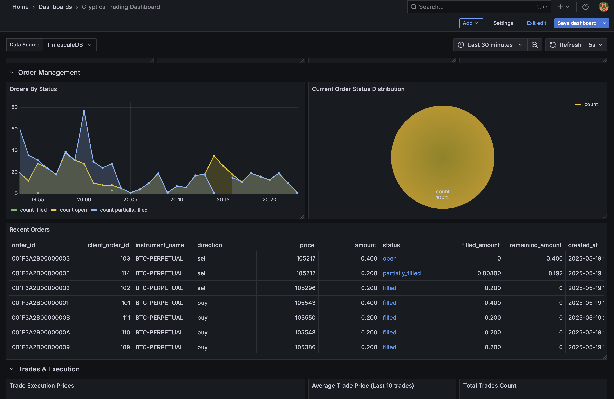
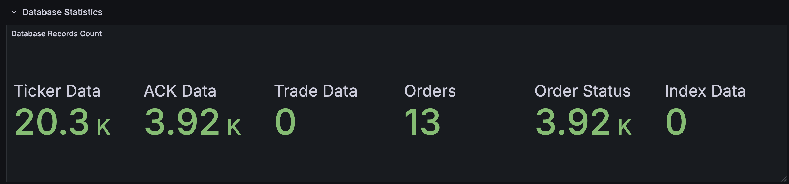
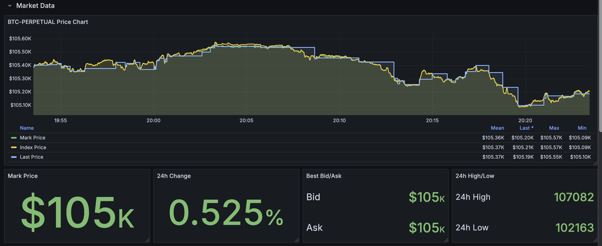

# CrypticsLabBot

A high-performance cryptocurrency trading system with real-time market data processing and algorithmic trading capabilities.

## System Overview

CrypticsLabBot is a distributed trading system designed to handle high-frequency market data and execute trading strategies with minimal latency. The system consists of:

- **Rust Trading Engine**: High-performance execution core
- **Python Data Pipeline**: Real-time data processing and persistence
- **Kafka Message Bus**: Scalable event streaming backbone
- **TimescaleDB**: Time-series optimized data storage

## Architecture

The system follows an event-driven architecture with clear separation of concerns:

```
Market Data --> [Rust Trading Engine] --> Order Execution
                      |
                      v
              [Kafka Message Bus]
                      |
                      v
             [Python Data Pipeline]
                      |
                      v
               [TimescaleDB]
                      |
                      v
                [Grafana Dashboards]
```

### Trading Logic

The system implements a basic market making strategy on cryptocurrency perpetual futures. The market maker maintains a presence on both sides of the orderbook by continuously quoting buy and sell prices.

> **Note**: The current quoting and trading logic is intentionally simple and is still in active development. The end goal is to have multiple specialized trading algorithms that communicate with a centralized pricing engine via Kafka, enabling more sophisticated strategies while maintaining the scalable, event-driven architecture.

Key aspects of the current trading logic:
- Continuous price quotation with configurable spreads
- Order book presence at multiple price levels
- WebSocket-based exchange communication
- Real-time market data processing

### Kafka Integration

Kafka serves as the central nervous system of the application, enabling:

1. **Scalability**: The system can handle sudden spikes in trading activity by distributing load across multiple nodes
2. **Fault Tolerance**: No data loss even if downstream systems are temporarily unavailable
3. **Decoupling**: Trading logic is separated from data persistence concerns
4. **Stream Processing**: Real-time analytics on trading data

### Data Pipeline

The Python data pipeline handles the downstream processing and persistence of trading data:

1. **Factory Pattern**: Leverages a factory pattern for producers and sink connectors, making it easy to add new data models
   - `ProducerFactory` and `ConnectorFactory` allow dynamic registration of new implementations
   - Standardized interface through base classes ensures consistent behavior

2. **Base Class Hierarchy**: 
   - `ModelBase` provides the foundation for all data models with consistent schema handling
   - `AvroProducerBase` implements core Kafka producer functionality with proper error handling
   - `BaseSinkConnector` abstracts JDBC connector configuration and management

3. **Schema Management**:
   - Versioned Avro schemas (v1.avsc, v2.avsc, etc.) for backward compatibility
   - Schema Registry integration ensures type safety across services
   - Proper handling of optional fields as union types `["null", "type"]`

4. **Sink Connectors**:
   - JDBC sink connectors automatically stream data from Kafka to TimescaleDB
   - Configurable for different database types without code changes
   - Built-in error handling and monitoring capabilities

### Data Serialization

The system uses Apache Avro for efficient, schema-based serialization:

- **Strong Typing**: Enforced schema validation prevents data corruption
- **Compact Format**: Optimized binary representation reduces network overhead
- **Schema Evolution**: Support for backward/forward compatibility as data models evolve
- **Language Agnostic**: Seamless integration between Rust and Python components

### Storage & Processing

Database operations are offloaded to dedicated components:

- SQL stored procedures handle data transformations to reduce workload on trading node
- TimescaleDB optimizes time-series query performance
- Kafka Connect manages data ingestion pipelines
- Schema versioning enables safe data migrations

### Latency Monitoring

The system includes comprehensive latency tracking at multiple stages:

- End-to-end latency from exchange event to database storage
- Exchange-to-Rust latency for market data processing
- Rust-to-database latency for data persistence
- Real-time latency visualizations in Grafana dashboards
- Historical latency analysis via SQL queries
- Automatic latency calculation via database triggers

For detailed information on latency monitoring, see [DEVELOPMENT.md](./DEVELOPMENT.md).

## Dashboard

The system includes a comprehensive Grafana dashboard for monitoring trading activity and system performance. To access the dashboard:

1. Start the system with Docker Compose:
   ```bash
   docker-compose up -d
   ```

2. Wait approximately 10 minutes for the system to fully initialize, process data, and set up the dashboard.

3. Access the dashboard at: [http://localhost:3000/d/cryptics-dashboard/cryptics-trading-dashboard](http://localhost:3000/d/cryptics-dashboard/cryptics-trading-dashboard)

Here's a preview of what you'll see:

### Trading Dashboard Overview


### Data Metrics


### Ticker Information


## Key Design Choices

### 1. Robust Schema Handling and Validation

The pipeline implements a schema-first approach with strict validation:
- Avro schemas with proper union types for optional fields (`["null", "type"]`)
- Schema validation on both producer and consumer sides
- Schema versioning to support evolution without breaking changes
- Local schema files version-tracked with proper compatibility checks

### 2. Kafka Connect with JDBC Sink

We use Kafka Connect's JDBC sink connector to:
- Stream data directly from Kafka to TimescaleDB without custom code
- Handle database schema compatibility automatically
- Support multiple database types (easily extensible to MySQL, Oracle, etc.)
- Implement proper error handling and connection management

### 3. Factory Pattern for Extensibility

The factory pattern implementation makes it simple to add new data models:
- Register new producer or connector with a single line of code
- Common functionality in base classes reduces duplication
- Consistent interface across all components
- Type safety through Python's typing system

### 4. Connector Readiness Polling

Instead of arbitrary sleep timers, the system implements proper readiness detection:
- Polls for connector status until confirmation of running state
- Handles connection failures with proper backoff
- Automatic connector lifecycle management

## Security Note

For demonstration purposes, API credentials for the Thalex development environment have been included in the repository configuration files (`.env` and `Cargo.toml`). In a production environment, these credentials would never be committed to version control, and would instead be:

1. Injected via environment variables during deployment
2. Stored in a secure secrets management system
3. Accessed via a dedicated service account with appropriate permissions

The included credentials are for a test account with limited permissions and are provided solely to simplify the evaluation process. They will be invalidated after the evaluation period.

## Development Setup

See [DEVELOPMENT.md](./DEVELOPMENT.md) for detailed setup instructions.

## TODO List

High priority improvements:
- Implement comprehensive test suite (unit and integration tests)
- Add Prometheus metrics for producer/consumer operations
- Implement dead letter queue for failed messages
- Improve security (TLS, authentication)


